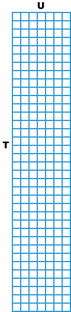

[](https://pepy.tech/project/warp-rnnt)

# CUDA-Warp RNN-Transducer
A GPU implementation of RNN Transducer (Graves [2012](https://arxiv.org/abs/1211.3711), [2013](https://arxiv.org/abs/1303.5778)).
This code is ported from the [reference implementation](https://github.com/awni/transducer/blob/master/ref_transduce.py) (by Awni Hannun)
and fully utilizes the CUDA warp mechanism.

The main bottleneck in the loss is a forward/backward pass, which based on the dynamic programming algorithm.
In particular, there is a nested loop to populate a lattice with shape (T, U),
and each value in this lattice depend on the two previous cells from each dimension (e.g. [forward pass](https://github.com/awni/transducer/blob/6b37e98c21551c7ed2181e2f526053bae8ae94d2/ref_transduce.py#L56)).

CUDA executes threads in groups of 32 parallel threads called [warps](https://docs.nvidia.com/cuda/cuda-c-programming-guide/index.html#simt-architecture).
Full efficiency is realized when all 32 threads of a warp agree on their execution path.
This is exactly what is used to optimize the RNN Transducer. The lattice is split into warps in the T dimension.
In each warp, variables between threads exchanged using a fast operations.
As soon as the current warp fills the last value, the next two warps (t+32, u) and (t, u+1) are start running. 
A schematic procedure for the forward pass is shown in the figure below, where T - number of frames, U - number of labels, W - warp size.
The similar procedure for the backward pass runs in parallel.




## Performance
[Benchmarked](pytorch_binding/benchmark.py) on a GeForce GTX 1080 Ti GPU, Intel i7-8700 CPU @ 3.20GHz.

|                         |    warp_rnnt    | [warprnnt_pytorch](https://github.com/HawkAaron/warp-transducer/tree/master/pytorch_binding) | [transducer](https://github.com/awni/transducer) |
| :---------------------- | ------------------: | ------------------: | ------------------: |
|  **T=150, U=40, V=28**  | 
|         N=1             |       0.07 ms       |       0.68 ms       |       1.28 ms       |
|         N=16            |       0.33 ms       |       1.80 ms       |       6.15 ms       |
|         N=32            |       0.35 ms       |       3.39 ms       |      12.72 ms       |
|         N=64            |       0.56 ms       |       6.11 ms       |      23.73 ms       |
|         N=128           |       0.60 ms       |       9.22 ms       |      47.93 ms       |
| **T=150, U=20, V=5000** |
|         N=1             |       0.46 ms       |       2.14 ms       |      21.18 ms       |
|         N=16            |       1.42 ms       |      21.24 ms       |     240.11 ms       |
|         N=32            |       2.51 ms       |      38.26 ms       |     490.66 ms       |
|         N=64            |    out-of-memory    |      75.54 ms       |     944.73 ms       |
|         N=128           |    out-of-memory    |    out-of-memory    |    1894.93 ms       |
| **T=1500, U=300, V=50** |
|         N=1             |       0.60 ms       |      10.77 ms       |     121.82 ms       |
|         N=16            |       2.25 ms       |      97.69 ms       |     732.50 ms       |
|         N=32            |       3.97 ms       |     184.73 ms       |    1448.54 ms       |
|         N=64            |    out-of-memory    |     out-of-memory   |    2767.59 ms       |


## Note
- This implementation assumes that the input is log_softmax.

- In addition to alphas/betas arrays, counts array is allocated with shape (N, U * 2), which is used as a scheduling mechanism.

- [core_gather.cu](core_gather.cu) is a slightly memory-efficient version that expects log_probs with the shape (N, T, U, 2) only for blank and labels values.

- Do not expect that this implementation will greatly reduce the training time of RNN Transducer model. Probably, the main bottleneck will be a trainable joint network with an output (N, T, U, V).

- Also, there is a restricted version, called [Recurrent Neural Aligner](https://github.com/1ytic/warp-rna), with assumption that the length of input sequence is equal to or greater than the length of target sequence.


## Install
Currently, there is only a binding for PyTorch 1.0 and higher.

```bash
pip install warp_rnnt
```

## Test
There is a unittest in `pytorch_binding/warp_rnnt` which includes tests for arguments and outputs as well.

```bash
python -m warp_rnnt.test
```

## Reference
- Awni Hannun [transducer](https://github.com/awni/transducer)

- Mingkun Huang [warp-transducer](https://github.com/HawkAaron/warp-transducer)
